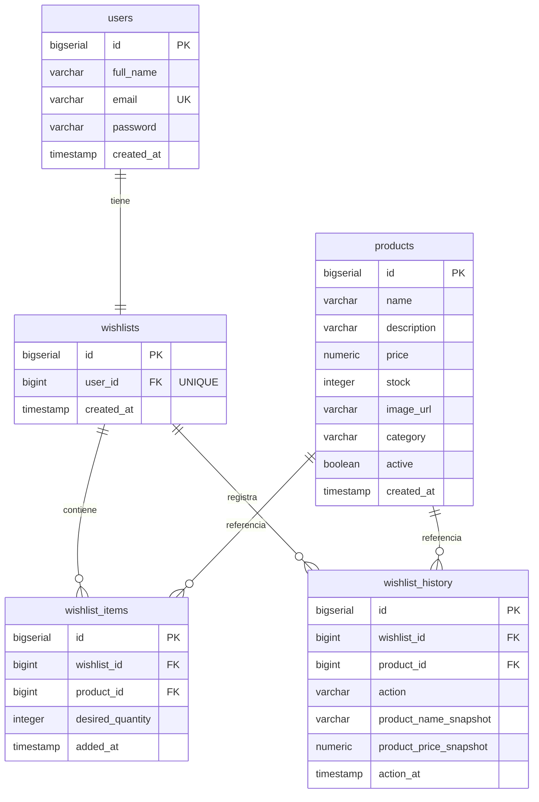

# Modelo de Base de Datos — Lista de Deseos (Wishlist)

**Proyecto:** carvajal-business-monolith
**Módulo:** Lista de Deseos — E-commerce B2C Carvajal (venta de computadores)
**Integrante 1:** Backend Core + Base de Datos
**Motor de base de datos:** PostgreSQL

---

## 1. Introducción

Este documento describe el modelo de datos del módulo de Lista de Deseos del e-commerce de Carvajal. El modelo permite que un cliente autenticado visualice el catálogo de productos con su stock, gestione una lista de deseos (agregar, listar, actualizar y eliminar productos), sea notificado cuando un producto deseado se queda sin stock, y conserve un histórico de todos los movimientos de su lista.

## 2. Motor seleccionado: PostgreSQL

Se eligió **PostgreSQL** como sistema de gestión de base de datos relacional por las siguientes razones:

- **Integridad referencial:** el modelo tiene múltiples relaciones (usuario–lista, lista–productos) donde las llaves foráneas y restricciones garantizan datos consistentes.
- **Tipos de datos precisos:** el tipo `NUMERIC(12,2)` maneja los precios sin errores de redondeo, algo crítico en un e-commerce.
- **Restricciones robustas:** soporta `CHECK`, `UNIQUE` compuesto y llaves foráneas, usados para reglas como evitar productos duplicados en una lista o stock negativo.
- **Estándar y open source:** ampliamente usado en la industria, con excelente integración con Spring Boot / JPA (Hibernate).

## 3. Diagrama Entidad-Relación

## 4. Descripción de las entidades

### 4.1 users
Almacena los usuarios del sistema. Según la prueba, se asume que el usuario ya existe y está autenticado. El campo `password` queda disponible para la autenticación con JWT (a cargo del Integrante 2). La tabla se llama `users` (en plural) porque `user` es una palabra reservada en PostgreSQL.

| Columna | Tipo | Restricción | Descripción |
|---|---|---|---|
| id | BIGSERIAL | PK | Identificador único |
| full_name | VARCHAR(120) | NOT NULL | Nombre completo |
| email | VARCHAR(150) | NOT NULL, UNIQUE | Correo (único) |
| password | VARCHAR(255) | NOT NULL | Contraseña (para JWT) |
| created_at | TIMESTAMP | NOT NULL | Fecha de creación |

### 4.2 products
Catálogo de productos de Carvajal (computadores, componentes y accesorios). El campo `stock` es clave para la notificación de productos agotados.

| Columna | Tipo | Restricción | Descripción |
|---|---|---|---|
| id | BIGSERIAL | PK | Identificador único |
| name | VARCHAR(150) | NOT NULL | Nombre del producto |
| description | VARCHAR(500) | | Descripción / especificaciones |
| price | NUMERIC(12,2) | NOT NULL, CHECK >= 0 | Precio en COP |
| stock | INTEGER | NOT NULL, CHECK >= 0 | Cantidad disponible |
| image_url | VARCHAR(300) | | URL de la imagen |
| category | VARCHAR(80) | | Categoría del producto |
| active | BOOLEAN | NOT NULL | Si está visible en el catálogo |
| created_at | TIMESTAMP | NOT NULL | Fecha de creación |

### 4.3 wishlists
Representa la lista de deseos de un usuario. Cada usuario tiene **una sola** lista, garantizado por la restricción `UNIQUE` en `user_id`.

| Columna | Tipo | Restricción | Descripción |
|---|---|---|---|
| id | BIGSERIAL | PK | Identificador único |
| user_id | BIGINT | NOT NULL, UNIQUE, FK → users | Dueño de la lista |
| created_at | TIMESTAMP | NOT NULL | Fecha de creación |

### 4.4 wishlist_items
Productos que están **actualmente** en la lista de deseos. La restricción `UNIQUE (wishlist_id, product_id)` evita que un mismo producto se agregue dos veces a la misma lista.

| Columna | Tipo | Restricción | Descripción |
|---|---|---|---|
| id | BIGSERIAL | PK | Identificador único |
| wishlist_id | BIGINT | NOT NULL, FK → wishlists | Lista a la que pertenece |
| product_id | BIGINT | NOT NULL, FK → products | Producto deseado |
| desired_quantity | INTEGER | NOT NULL, CHECK > 0 | Cantidad deseada |
| added_at | TIMESTAMP | NOT NULL | Fecha en que se agregó |

### 4.5 wishlist_history
Histórico de todos los movimientos de la lista de deseos. Cada vez que un producto entra (`ADDED`), se actualiza (`UPDATED`) o se elimina (`REMOVED`), se guarda un registro. Se conserva una "foto" (snapshot) del nombre y precio del producto en ese momento, para que el histórico no cambie aunque el producto se edite o elimine después.

| Columna | Tipo | Restricción | Descripción |
|---|---|---|---|
| id | BIGSERIAL | PK | Identificador único |
| wishlist_id | BIGINT | NOT NULL, FK → wishlists | Lista asociada |
| product_id | BIGINT | NOT NULL, FK → products | Producto del movimiento |
| action | VARCHAR(20) | NOT NULL, CHECK | ADDED, UPDATED o REMOVED |
| product_name_snapshot | VARCHAR(150) | NOT NULL | Nombre del producto al momento |
| product_price_snapshot | NUMERIC(12,2) | NOT NULL | Precio del producto al momento |
| action_at | TIMESTAMP | NOT NULL | Fecha del movimiento |

## 5. Relaciones y cardinalidades

| Relación | Cardinalidad | Descripción |
|---|---|---|
| users → wishlists | 1 : 1 | Cada usuario tiene una lista de deseos |
| wishlists → wishlist_items | 1 : N | Una lista contiene varios productos |
| products → wishlist_items | 1 : N | Un producto puede estar en varias listas |
| wishlists → wishlist_history | 1 : N | Una lista genera varios movimientos |
| products → wishlist_history | 1 : N | Un producto aparece en varios movimientos |

## 6. Reglas de negocio soportadas

- **Catálogo con stock:** la tabla `products` expone la cantidad disponible (`stock`) para mostrarla al cliente.
- **Gestión de la lista:** `wishlist_items` permite listar, agregar, actualizar y eliminar productos deseados.
- **Sin duplicados:** la restricción `UNIQUE (wishlist_id, product_id)` impide agregar el mismo producto dos veces.
- **Notificación de agotados:** al consultar la lista, se compara el `stock` del producto; si es 0, se notifica al cliente.
- **Histórico permanente:** `wishlist_history` conserva todos los movimientos con snapshots de nombre y precio, cumpliendo el requisito de almacenar el histórico de registros de la lista de deseos.
- **Integridad de precios:** el tipo `NUMERIC(12,2)` y el `CHECK (price >= 0)` garantizan precios válidos.